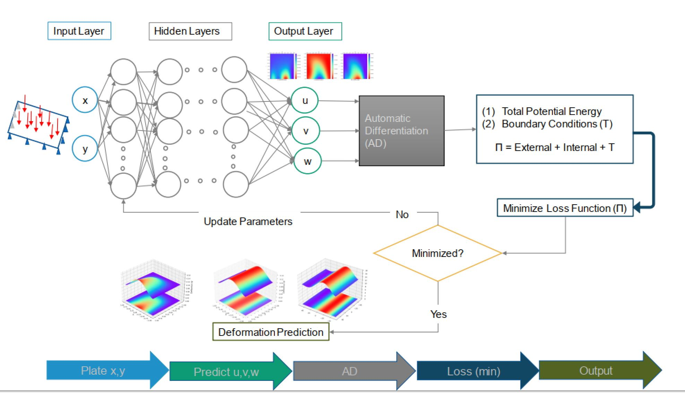
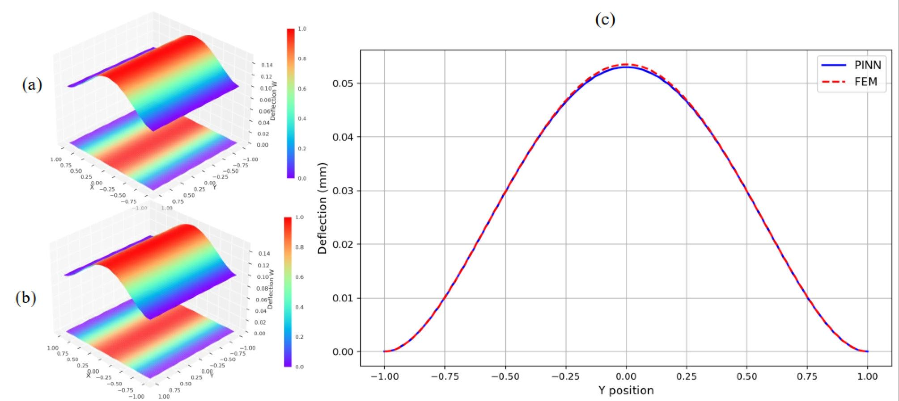
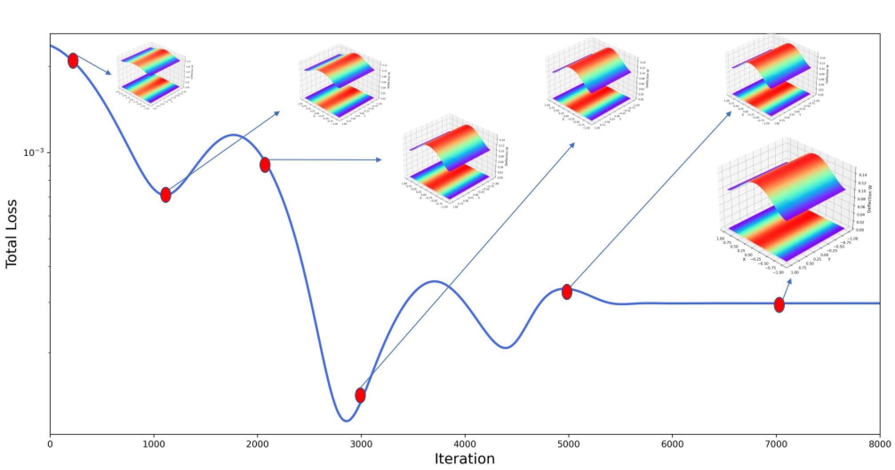

# Physics-Aware Mesh-Free Deep Learning for Rectangular Elastic Plate Deformation with Support-Dependent Boundary Enforcement

[](https://doi.org/10.1142/S1758825125501091) 
[](https://opensource.org/licenses/MIT)

This repository contains the official implementation of the paper:

**Physics-Aware Mesh-Free Deep Learning for Rectangular Elastic Plate Deformation with Support-Dependent Boundary Enforcement**  
*International Journal of Applied Mechanics*, 2025  
DOI: [10.1142/S1758825125501091](https://doi.org/10.1142/S1758825125501091)

Authors: Haroon Ijaz, Ali Qabur, Khaled Aati, Abdulrahman Abbadi, Salamat Ullah

## Abstract

This study introduces a physics-aware, mesh-free deep learning framework for modeling the bending behavior of elastic plates under complex and arbitrary support conditions. The proposed method serves as a data-free surrogate model that generalizes across a wide
range of boundary configurations, addressing key limitations of conventional numerical techniques and earlier PINN-based approaches. The formulation is based on minimizing the total potential of the system, which incorporates internal strain energy, virtual external work, and support-specific boundary penalty terms. Distinct constraints on each plate edge are enforced through edge-dependent penalties, enabling automatic adaptation to changing boundary conditions without remeshing or problem reformulation. The neural
network architecture consists of three decoupled subnetworks to approximate transverse and in-plane displacements. Automatic differentiation is employed to compute curvature and slope terms essential for higher-order plate theory. The training process combines structured and randomized sampling across both domain interiors and boundaries to ensure accuracy and stability. Benchmark comparisons against finite element method (FEM) results demonstrate that the proposed model achieves mean relative errors below 3% across diverse support configurations. The framework captures both out-of-plane and in-plane displacement fields with high fidelity and robust convergence. These results highlight the method’s potential as a flexible, generalizable solution for elastic plate deformation analysis in engineering applications involving complex geometries and support conditions.

## Results

### Framework


### CCSS bending and error analysis


### CCSS interim results during training



## Acknowledgements

This work is built upon the open-source [repository](https://github.com/weili101/Deep_Plates). We sincerely thank the author for making the original code publicly available.

## Citation

If you use this code or find our work helpful, please cite:

```bibtex
@article{ijaz2025physics,
  author    = {Ijaz, Haroon and Qabur, Ali and Aati, Khaled and Abbadi, Abdulrahman and Ullah, Salamat},
  title     = {Physics-Aware Mesh-Free Deep Learning for Rectangular Elastic Plate Deformation with Support-Dependent Boundary Enforcement},
  journal   = {International Journal of Applied Mechanics},
  volume    = {17},
  number    = {09},
  pages     = {2550109},
  year      = {2025},
  doi       = {10.1142/S175882512550109X},
  publisher = {World Scientific}
}


